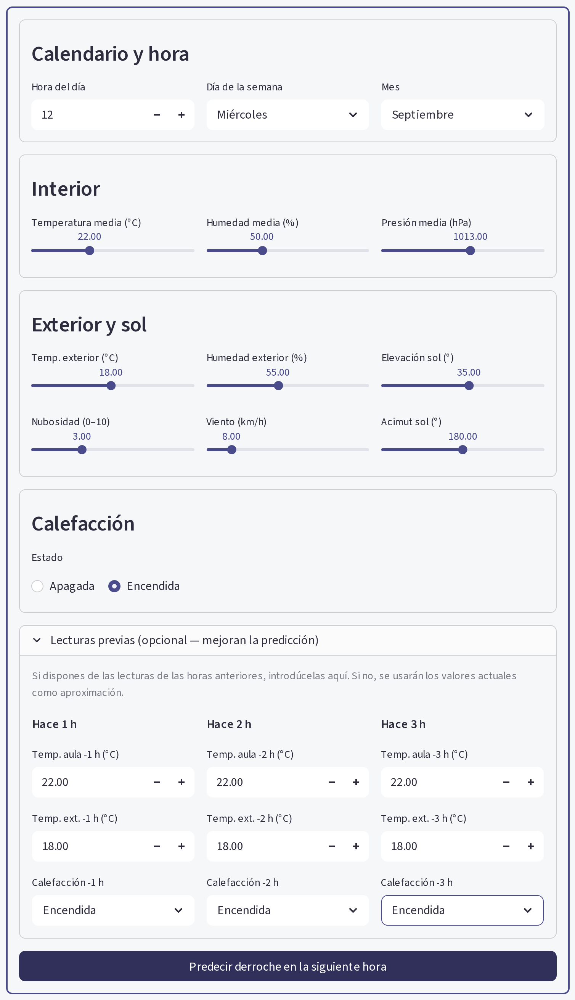
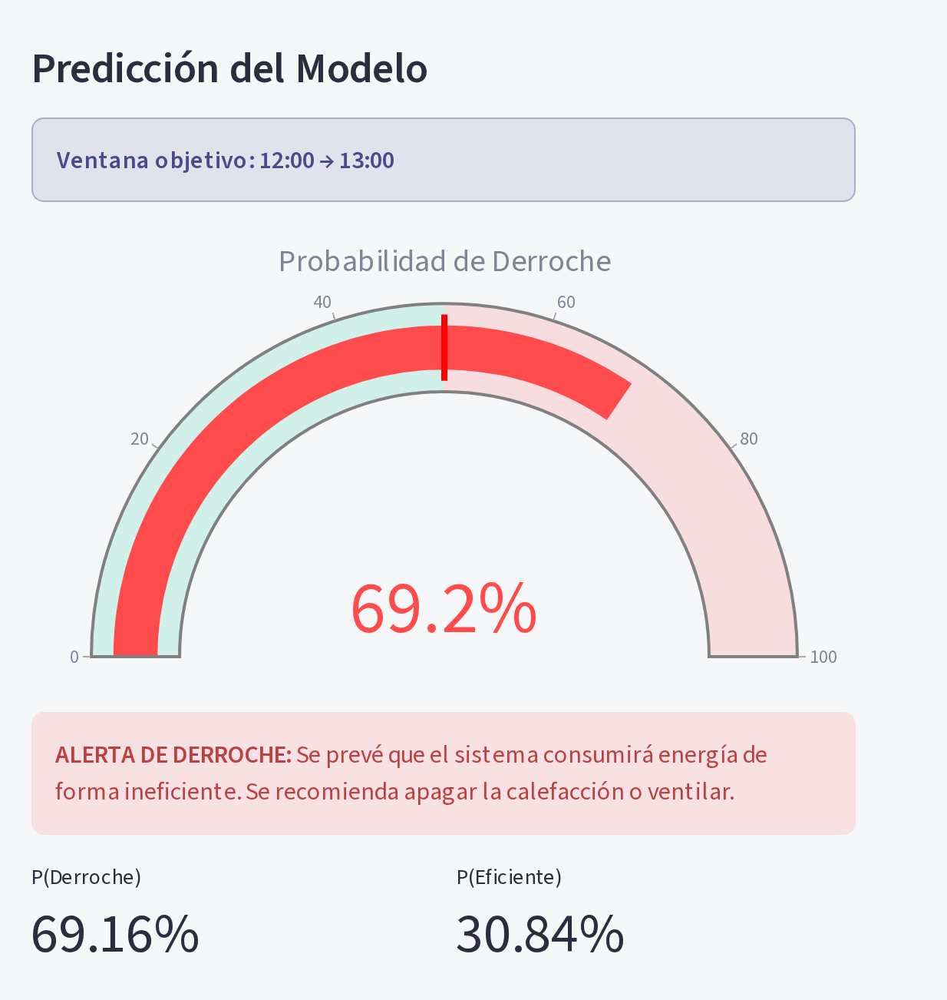

# App de predicción

Interfaz Streamlit para lanzar predicciones manuales de derroche a partir de lecturas puntuales.

- [1. Tecnología](#1-tecnología)
- [2. Interfaz](#2-interfaz)
- [3. Salida](#3-salida)
- [4. Pipeline de inferencia](#4-pipeline-de-inferencia)
- [5. Ejecución](#5-ejecución)

---

## 1. Tecnología

**Streamlit** + **Plotly**.

| Fichero | Rol |
|---|---|
| `app/main.py` | Interfaz: formulario, estilos y visualización |
| `app/predictor.py` | Inferencia: arquitecturas, construcción de features y `predict()` |
| `.streamlit/config.toml` | Tema visual |

Artefactos que carga: `models/model_derroche_v2.pt` y `models/scaler_derroche_v2.joblib`.

## 2. Interfaz

Formulario dividido en secciones:

1. **Calendario y hora** — hora del día, día de la semana, mes del año
2. **Interior (aula)** — temperatura, humedad y presión medias
3. **Exterior y sol** — temperatura exterior, nubosidad, humedad exterior, viento, elevación y acimut solar
4. **Calefacción** — encendida / apagada
5. **Lecturas previas (opcional)** — datos de las 3 horas anteriores; si no se rellenan, se
   usan los valores actuales como aproximación de los lags



## 3. Salida

Al pulsar *Predecir derroche en la siguiente hora*:

- **Gauge** de probabilidad de derroche (0-100 %), con escala verde/rojo
- **Alerta o confirmación** según se prevea derroche o no
- **Métricas** P(Derroche) y P(Eficiente) en porcentaje
- **Ventana objetivo**: rango horario al que se refiere la predicción (p. ej. `12:00 → 13:00`)



## 4. Pipeline de inferencia

`app/predictor.py::predict()` ejecuta:

1. Si `calefaccion_encendida == 0` → devuelve `(0, 0.0)` sin invocar la red
   (ver [modelo-ml.md § Regla de negocio](modelo-ml.md#5-regla-de-negocio))
2. `_build_v2_features()` deriva las 31 features: codificación cíclica de hora/día/mes,
   lags de 1-3 h, deltas de temperatura e interacciones
3. Escalado con `scaler_derroche_v2.joblib`
4. Forward de `RedDerrocheV2` en modo `eval()`
5. Sigmoide sobre el logit y comparación con el umbral óptimo (0.50)

El mismo módulo lo reutiliza el servicio en tiempo real (ver [tiempo-real.md](tiempo-real.md)),
de modo que app y pipeline comparten exactamente la misma lógica de features.

## 5. Ejecución

```bash
pip install -r requirements.txt
streamlit run app/main.py
```

Disponible en http://localhost:8501
