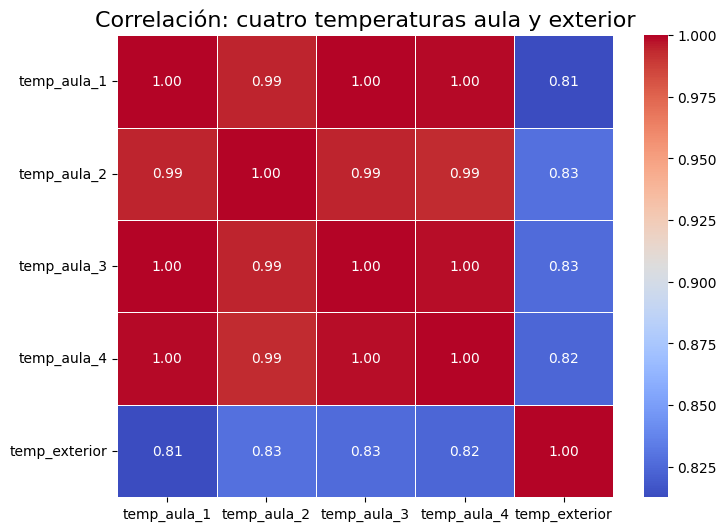
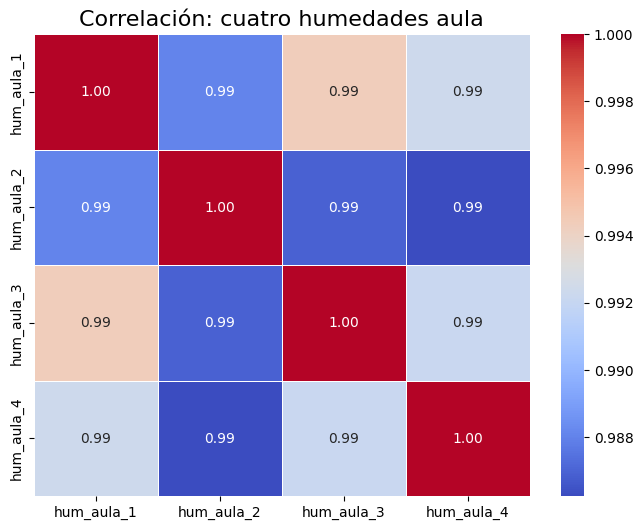
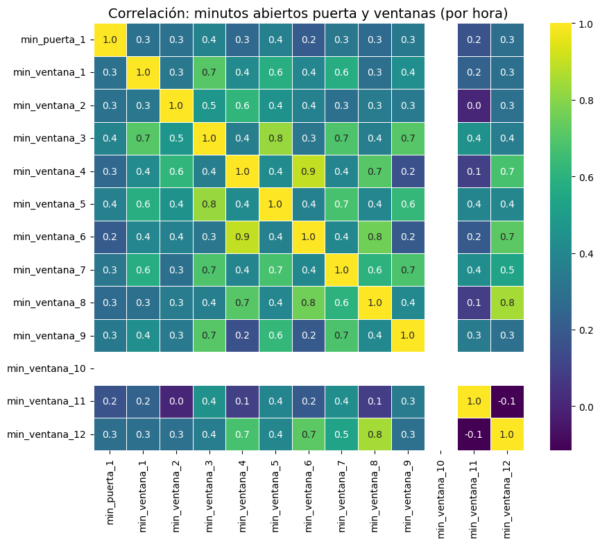
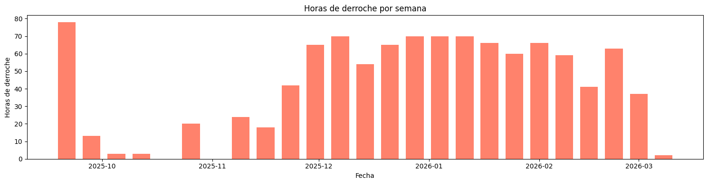
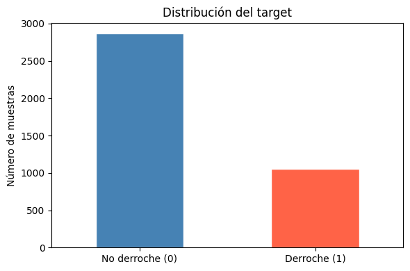

# Pipeline de datos

Desde la tabla cruda `ltss` hasta el dataset final de entrenamiento. Cubre las capas
bronze/silver/gold, el análisis de correlaciones y la construcción del target.

- [1. Capa Bronze](#1-capa-bronze)
- [2. Capa Silver](#2-capa-silver)
- [3. Capa Gold](#3-capa-gold)
- [4. Análisis de correlaciones](#4-análisis-de-correlaciones)
- [5. Construcción del dataset](#5-construcción-del-dataset)
- [6. Dataset final](#6-dataset-final)
- [7. Regenerar los datos](#7-regenerar-los-datos)

---

## 1. Capa Bronze

**Vista:** `bronze_sensores` — `sql/01_bronze_extract.sql`

**Decisión:** filtrar de `ltss` únicamente las entidades relevantes: los 4 sensores de
temperatura/humedad/presión, la puerta, las 12 ventanas y los sensores externos
(meteorología y sol).

**Justificación:** reduce el volumen a procesar y elimina entidades no relacionadas con el problema.

```sql
CREATE OR REPLACE VIEW bronze_sensores AS
SELECT "time", entity_id, state, attributes
FROM ltss
WHERE entity_id IN (
    'sensor.sensor_temperatura_1_temperature',
    'sensor.sensor_temperatura_2_temperature',
    -- ... (4 sensores × 3 magnitudes + 1 puerta + 12 ventanas + 6 externos)
);
```

## 2. Capa Silver

**Vista:** `silver_sensores` — `sql/02_silver_clean.sql`

**Decisión:** convertir `state` (texto) a numérico y unificar formatos:

- Sensores binarios (puertas/ventanas): `on → 1.0`, `off → 0.0`
- Sensor de presión 1: conversión de inHg a hPa (× 33.8639)
- Se descartan `unavailable`, `unknown` y vacíos

**Justificación:** Home Assistant almacena todos los valores como texto; el análisis
estadístico exige tipos numéricos.

## 3. Capa Gold

**Vista:** `gold_features_horaria` — `sql/03_gold_features_hourly.sql`
(replicada en `infra/init-scripts/03_vistas.sql`)

**Decisión:** agregar por hora y calcular:

- Media de temperatura, humedad y presión del aula
- Minutos con puerta/ventanas abiertas por hora
- Media de temperatura exterior, nubosidad, humedad exterior y velocidad del viento
- Media de elevación y acimut solar

**Justificación:** el nivel horario reduce el ruido sin perder variación relevante.

La vista usa **solo el sensor 2** para temperatura/humedad/presión del aula: el análisis de
correlación demuestra que los 4 sensores son redundantes y el 2 es el que tiene más datos.

**Vista auxiliar:** `gold_correlaciones` — `sql/04_gold_correlaciones.sql`. Expone los 4
sensores en paralelo para poder medir la redundancia entre ellos.

## 4. Análisis de correlaciones

Notebook: `notebooks/01_eda.ipynb`

### Temperatura

Los 4 sensores presentan correlaciones **> 0.95** entre sí: alta redundancia. Es viable
reducir a un único sensor representativo — se elige el **sensor 2** por cobertura de datos.



### Humedad

Mismo patrón que temperatura: alta correlación entre sensores. Se puede prescindir de 3 de
los 4 sin pérdida significativa de información.





## 5. Construcción del dataset

Notebook: `notebooks/02_dataset_gold.ipynb`

### 5.1 Agregación horaria y enriquecimiento

Lee `gold_features_horaria` desde PostgreSQL y enriquece con:

- Variables de calendario: `hora_del_dia`, `dia_de_la_semana`, `mes_del_ano`
- Datos de calefacción: join con `data/bronze/historico_calefaccion.csv`
- Imputación de nulos

**Resultado:** `data/silver/dataset_horario.csv` — 3.925 registros horarios.

### 5.2 Inferencia de la temperatura de calefacción

Ver [modelo-ml.md § Regresión lineal](modelo-ml.md#1-regresión-lineal-temperatura-de-calefacción).

### 5.3 Estado de la calefacción

Añade la columna `calefaccion_encendida` (0/1) a partir de la temperatura inferida por el
modelo lineal y del algoritmo de termostato
(`scripts/estado_calefaccion.py::algoritmo_termostato_raw`).

**Resultado:** `data/gold/dataset_calefaccion.csv`

### 5.4 Derroche actual

Calcula los **minutos ponderados** de apertura: la puerta cuenta como 2 ventanas inferiores,
y cada ventana inferior como 2 superiores.

```
derroche_actual = 1  ⟺  calefaccion_encendida = 1
                   AND  minutos_ponderados_abiertos > 12   (20 % × 60 min)
```

**Resultado:** `data/gold/dataset_derroche.csv`



### 5.5 Target: derroche en la hora siguiente

Crea `derroche_siguiente_hora` desplazando `derroche_actual` una hora hacia adelante.
Esta es la variable **target** del modelo de IA: dados los sensores de la hora actual,
predecir si habrá derroche en la siguiente.

**Resultado:** `data/gold/dataset_target.csv`

### 5.6 Poda de columnas

Elimina las columnas intermedias (estado de puertas/ventanas, minutos abiertos, temperatura
inferida de calefacción), que introducirían fuga de información y sobreajuste.

**Resultado:** `data/gold/dataset_entrenamiento.csv`

## 6. Dataset final

**3.924 muestras** — 1.058 derroche / 2.866 no derroche (**26,96 % positivos**).

| Columna | Descripción |
|---|---|
| `hora_del_dia` | Hora (0-23) |
| `dia_de_la_semana` | Día (1-7) |
| `mes_del_ano` | Mes (1-12) |
| `temp_aula` | Temperatura media del aula (°C) |
| `hum_aula` | Humedad media del aula (%) |
| `pres_aula` | Presión media del aula (hPa) |
| `temp_exterior` | Temperatura exterior (°C) |
| `nubosidad` | Nubosidad (0-10) |
| `hum_exterior` | Humedad exterior (%) |
| `vel_viento` | Velocidad del viento (km/h) |
| `elevacion_sol` | Elevación solar (°) |
| `acimut_sol` | Acimut solar (°) |
| `calefaccion_encendida` | Estado de la calefacción (0/1) |
| `derroche_siguiente_hora` | **TARGET** — derroche en la hora siguiente (0/1) |



## 7. Regenerar los datos

El volcado completo de `ltss` (`infra/init-scripts/02_datos.sql`, **222 MB**) está excluido
del repositorio: supera el límite de 100 MB por fichero de GitHub. Para reconstruirlo:

```bash
pg_dump -h <host_home_assistant> -U postgres -t ltss --data-only postgres \
  > infra/init-scripts/02_datos.sql
```

Sin ese volcado, el stack histórico levanta la tabla vacía. El stack en tiempo real no lo
necesita: se alimenta del simulador (ver [tiempo-real.md](tiempo-real.md)).

Los CSV de `data/` sí están versionados y permiten reejecutar los notebooks sin base de datos.
