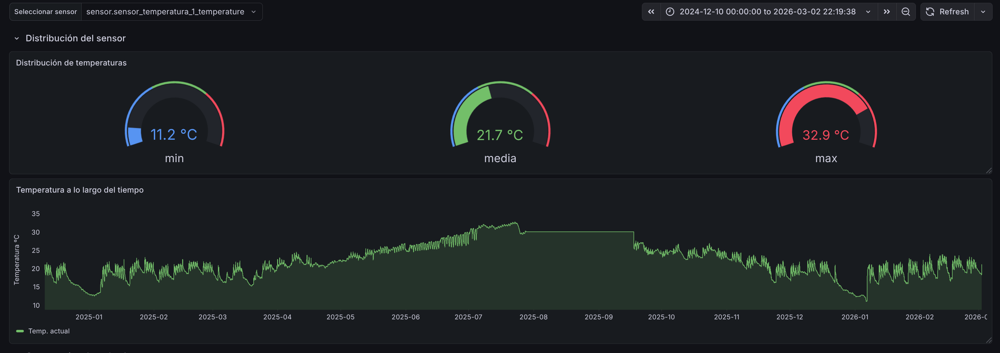
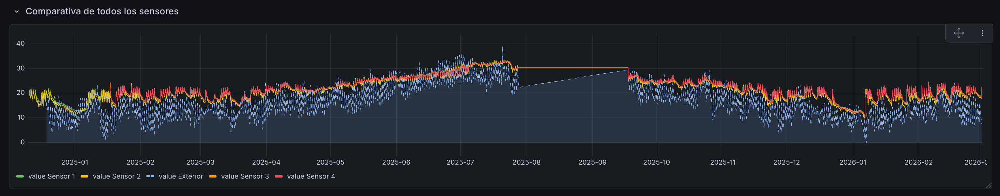
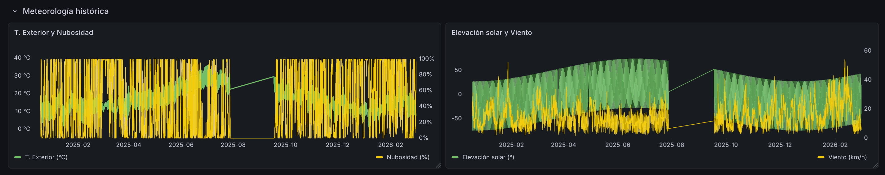
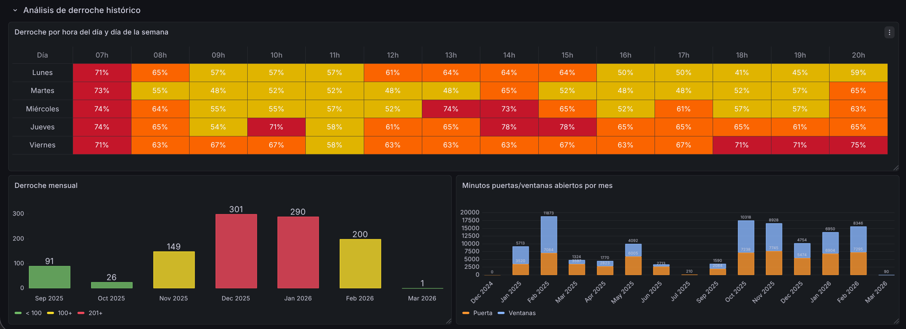
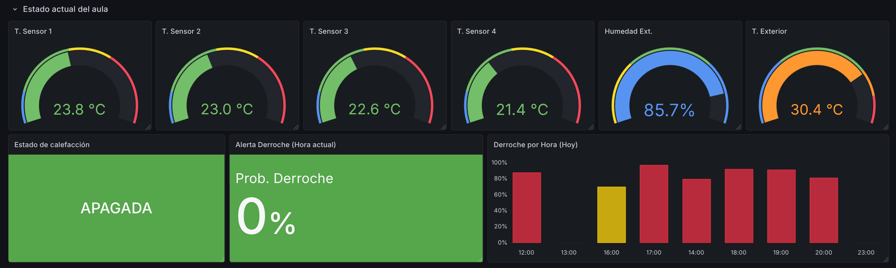
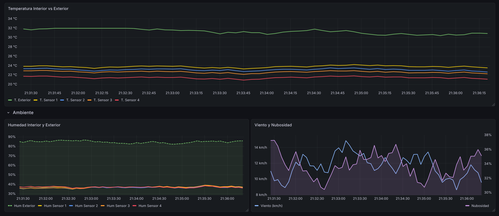
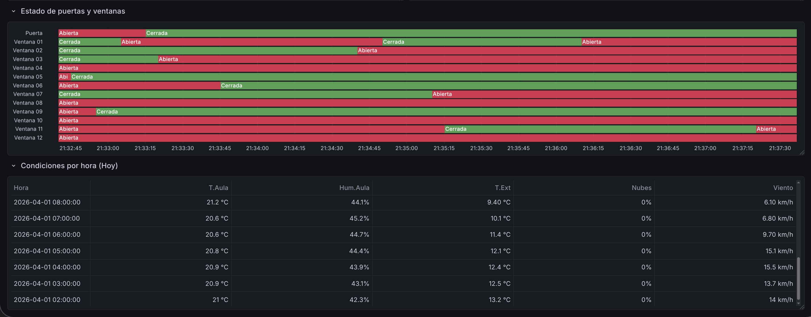

# Dashboards de Grafana

Dos cuadros de mando: uno sobre el histórico completo y otro sobre el stream en directo.

- [1. Provisioning](#1-provisioning)
- [2. Dashboard histórico](#2-dashboard-histórico)
- [3. Dashboard en tiempo real](#3-dashboard-en-tiempo-real)

---

## 1. Provisioning

Ambos stacks provisionan datasource y dashboards automáticamente al arrancar; no hay
configuración manual en la UI.

| Stack | Datasource | Dashboards |
|---|---|---|
| Histórico | `infra/grafana/provisioning/datasources/timescaledb.yml` | `infra/grafana/dashboards/` |
| Tiempo real | `infra/grafana-live/provisioning/datasources/timescaledb.yml` | `infra/grafana-live/dashboards/` |

La contraseña del datasource se inyecta desde la variable de entorno `PG_PASSWORD`, que
Docker Compose toma de `.env`. No hay credenciales en los ficheros de provisioning.

## 2. Dashboard histórico

`infra/grafana/dashboards/historico.json` — Grafana en http://localhost:3000

**Paneles:**

1. **Distribución del sensor** — tres gauges (mín, media, máx) de temperatura del sensor elegido
2. **Temperatura a lo largo del tiempo** — serie temporal del sensor seleccionado
3. **Comparativa de todos los sensores** — los 4 sensores interiores frente al exterior
4. **Humedad histórica** — humedad de los sensores interiores frente a la exterior
5. **Meteorología histórica**
   - Temperatura exterior y porcentaje de nubosidad
   - Elevación solar y velocidad del viento
6. **Análisis de derroche histórico**
   - Mapa de calor: porcentaje de derroche por hora del día y día de la semana
   - Barras: horas de derroche por mes
   - Barras apiladas: minutos de puertas y ventanas abiertas por mes

## 3. Dashboard en tiempo real

`infra/grafana-live/dashboards/tiempo_real.json` — Grafana en http://localhost:3001

Consume `silver_sensores` (query base en `sql/05_grafana_live_silver.sql`) y la tabla
`predicciones_derroche` que alimenta el servicio de inferencia. Muestra gauges de los
sensores activos, series temporales en ventana móvil y la probabilidad de derroche
prevista para la hora siguiente.

Requiere el stack en tiempo real con el perfil `simulate` activo — ver
[tiempo-real.md](tiempo-real.md).
