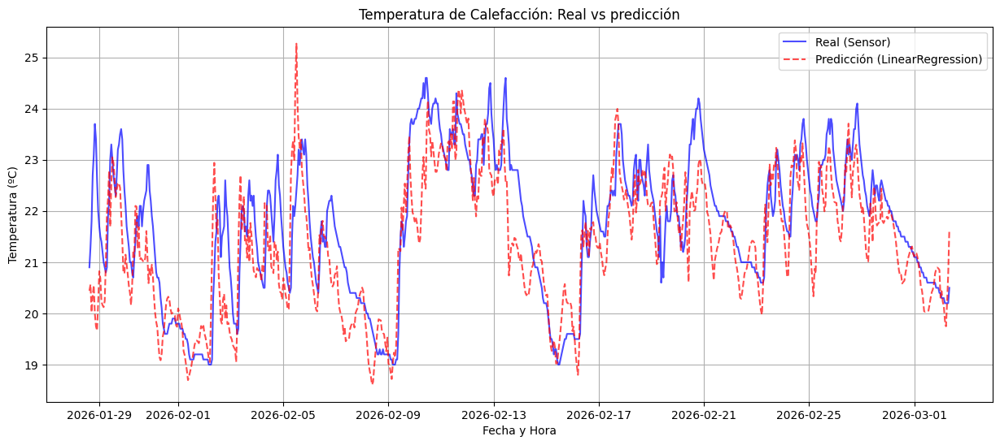
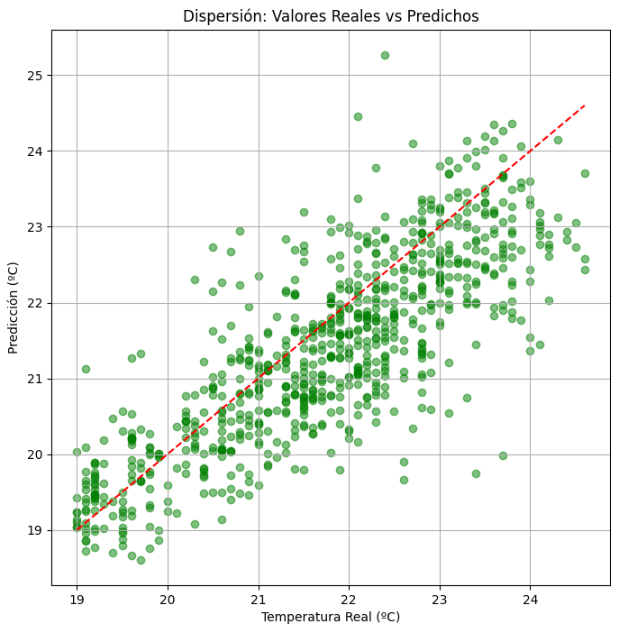
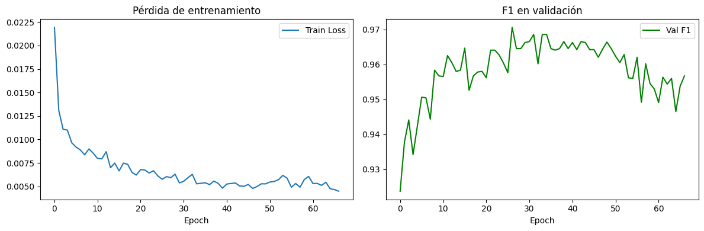
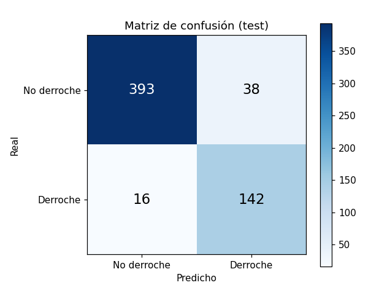
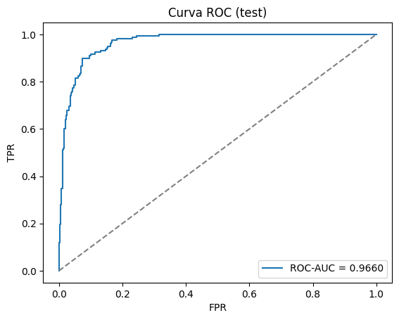
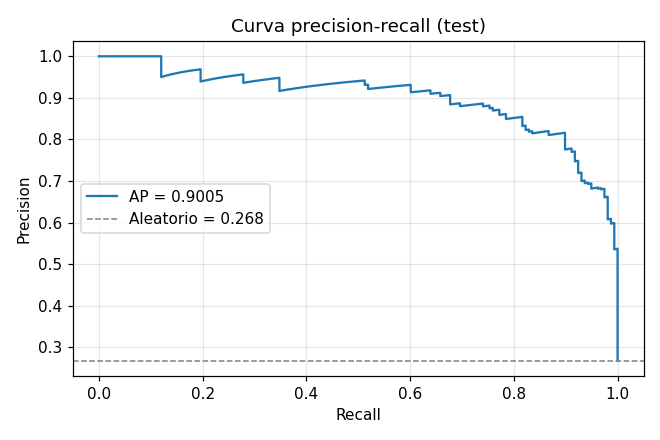

# Modelos

Dos modelos encadenados: una regresión lineal que infiere el estado de la calefacción, y
una red neuronal que predice el derroche de la hora siguiente.

- [1. Regresión lineal: temperatura de calefacción](#1-regresión-lineal-temperatura-de-calefacción)
- [2. Red neuronal V1](#2-red-neuronal-v1)
- [3. Red neuronal V2 (modelo final)](#3-red-neuronal-v2-modelo-final)
- [4. Métricas en test](#4-métricas-en-test)
- [5. Regla de negocio](#5-regla-de-negocio)
- [6. Artefactos](#6-artefactos)

---

## 1. Regresión lineal: temperatura de calefacción

Notebooks `notebooks/02_build_gold.ipynb` y `notebooks/03_model_ml.ipynb`.
Entrenamiento reproducible: `scripts/train_calefaccion.py`.

**Objetivo:** inferir la temperatura del sensor de calefacción a partir de las condiciones
del aula, ya que no se dispone de lectura directa continua.

**Features:** `temp_aula`, `hum_aula`, `pres_aula`, `temp_exterior`, `nubosidad`,
`elevacion_sol`, `acimut_sol`

| Métrica | Train | Test |
|---|---|---|
| R² | 0.9334 | 0.5623 |
| MAE | 0.6789 | 0.7160 |
| RMSE | 0.9091 | 0.8997 |

**Coeficientes:**

| Feature | Coeficiente |
|---|---|
| temp_aula | 0.7884 |
| hum_aula | -0.0492 |
| pres_aula | 0.0148 |
| temp_exterior | 0.0883 |
| nubosidad | 0.0014 |
| elevacion_sol | -0.0119 |
| acimut_sol | -0.0013 |
| intercept | -7.6510 |

**Lectura:** el peso dominante es `temp_aula` (0.79), coherente con la física del problema.
El R² de 0.56 en test indica un ajuste moderado, suficiente para alimentar el algoritmo de
termostato que decide `calefaccion_encendida`.





## 2. Red neuronal V1

Notebook: `notebooks/04_model_nn.ipynb` — clase `RedDerroche` en `app/predictor.py`.

```
Input (13 features)
  → Linear(13, 64) → ReLU → BatchNorm(64) → Dropout(0.3)
  → Linear(64, 32) → ReLU → BatchNorm(32) → Dropout(0.3)
  → Linear(32, 1)
```

- Pérdida: `BCEWithLogitsLoss` con `pos_weight` para compensar el desbalance
- Optimizador: Adam (lr = 1e-3), scheduler `ReduceLROnPlateau`
- 1.000 épocas, batch size 64
- Partición **temporal** (sin shuffle): 70 % train / 15 % validación / 15 % test

**Mejor Val F1 ≈ 0.89**

## 3. Red neuronal V2 (modelo final)

Notebook: `notebooks/04b_model_nn_improved.ipynb` — clase `RedDerrocheV2` en `app/predictor.py`.

| Aspecto | V1 | V2 |
|---|---|---|
| Features | 13 originales | 31 (originales + lag + cíclicas + interacción) |
| Codificación temporal | Directa | Cíclica (sin/cos para hora, día, mes) |
| Lags | No | 3 h (temp_aula, temp_exterior, calefacción) |
| Deltas | No | Sí (variación 1 h y 2 h de temperatura) |
| Interacciones | No | `calef × diff_temp`, `calef × viento` |
| Activación | ReLU | GELU |
| Conexión residual | No | Sí (skip connection) |
| Pérdida | BCEWithLogitsLoss | Focal Loss (α = 0.25, γ = 2.0) |
| Optimizador | Adam | AdamW (weight_decay = 1e-4) |
| Scheduler | ReduceLROnPlateau | CosineAnnealingWarmRestarts |
| Early stopping | No | Sí (patience = 40) |
| Umbral | Fijo (0.5) | Optimizado por F1 en validación |
| Gradient clipping | No | Sí (max_norm = 1.0) |
| Parámetros | ~3.500 | 46.081 |

```
Input (31 features)
  → Linear(31, 128) → BatchNorm(128) → GELU → Dropout(0.3)
  → Linear(128, 128) → BatchNorm(128) → GELU → Dropout(0.3) + Skip(residual)
  → Linear(128, 64)  → BatchNorm(64)  → GELU → Dropout(0.3)
  → Linear(64, 1)
```

**Las 31 features:**

| Grupo | N | Columnas |
|---|---|---|
| Temporales cíclicas | 6 | hora_sin/cos, dia_sin/cos, mes_sin/cos |
| Ambiente interior | 3 | temp_aula, hum_aula, pres_aula |
| Ambiente exterior | 4 | temp_exterior, nubosidad, hum_exterior, vel_viento |
| Sol | 2 | elevacion_sol, acimut_sol |
| Calefacción | 1 | calefaccion_encendida |
| Lags 1-3 h | 9 | temp_aula_lag1/2/3, temp_exterior_lag1/2/3, calefaccion_lag1/2/3 |
| Deltas | 3 | delta_temp_aula_1h, delta_temp_aula_2h, delta_temp_exterior_1h |
| Interacciones | 3 | diff_temp, calef_x_diff, calef_x_viento |

**Entrenamiento:** early stopping en la época 67 (de 500 máximas).
Mejor Val F1 **0.9706**, umbral óptimo **0.50**.



## 4. Métricas en test

Reproducibles con `notebooks/05_evaluation.ipynb`, que carga los artefactos de `models/` con la
misma clase que usan la app y el pipeline en tiempo real, y compara contra los valores de esta
tabla. Si el `.pt` guardado y el código de inferencia se desincronizan, ese notebook falla.


| Métrica | Valor |
|---|---|
| Accuracy | 0.9083 |
| Precision | 0.7889 |
| Recall | 0.8987 |
| F1-Score | 0.8402 |
| ROC-AUC | 0.9660 |

**Matriz de confusión:**

| | Predicho: No derroche | Predicho: Derroche |
|---|---|---|
| **Real: No derroche** | 393 | 38 |
| **Real: Derroche** | 16 | 142 |

**Informe de clasificación:**

| Clase | Precision | Recall | F1-Score | Support |
|---|---|---|---|---|
| No derroche | 0.96 | 0.91 | 0.94 | 431 |
| Derroche | 0.79 | 0.90 | 0.84 | 158 |
| **Accuracy** | | | **0.91** | **589** |
| **Macro avg** | 0.87 | 0.91 | 0.89 | 589 |
| **Weighted avg** | 0.91 | 0.91 | 0.91 | 589 |

**Por qué F1 y Recall y no Accuracy:**

- La clase derroche es minoritaria (27 % de las muestras): la accuracy premia al modelo trivial.
- Un falso positivo (alertar sin derroche) cuesta mucho menos que un falso negativo
  (no detectar derroche real), así que se prioriza el recall de la clase positiva.
- El ROC-AUC de 0.966 confirma que el modelo separa bien ambas clases.







## 5. Regla de negocio

El predictor aplica una regla determinista antes de la red: si
`calefaccion_encendida == 0`, la predicción es **no derroche** con probabilidad 0.0.
Es una consecuencia directa de la definición: sin calefacción encendida no puede haber derroche.

## 6. Artefactos

| Fichero | Contenido |
|---|---|
| `models/model_derroche_v2.pt` | Pesos de `RedDerrocheV2` (modelo en producción) |
| `models/model_derroche_v2_best.pt` | Checkpoint de la mejor época de validación |
| `models/scaler_derroche_v2.joblib` | `StandardScaler` de las 31 features de V2 |
| `models/scaler_derroche.joblib` | Scaler de la V1 (13 features) |
| `models/calefaccion_linear.joblib` | Pipeline de la regresión lineal de calefacción |
